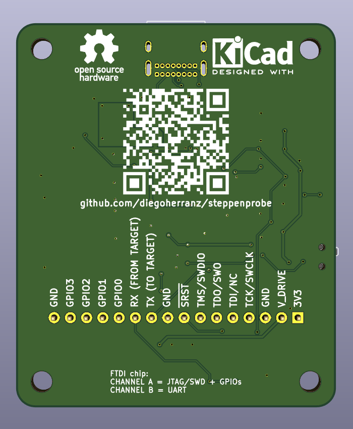
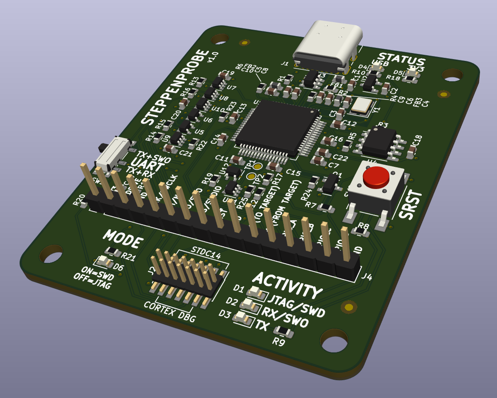

Steppenprobe
============
Open Source Hardware JTAG/SWD/UART/SWO interface board

https://github.com/diegoherranz/steppenprobe

Basic specs:
-----------
- Open Source Hardware and designed in [KiCad](https://kicad-pcb.org).
- [FT2232H](https://ftdichip.com/products/ft2232hl)-based
- Simultaneous operation of JTAG/SWD and UART/SWO.
- STDC14 connector: standard Arm Cortex debug connector (1.27 mm pitch) with extra pins for UART. JTAG/SWD and UART on a single connector while being compatible with the standard Arm Cortex debug connector (middle 10 pins).
- USB powered: no power supply needed.
- USB type-C receptacle: more convenient (reversible) and future-proof (it should be the most common connector in the near future even if it isn't now, as of late 2019).
- OpenOCD compatible, supported from version 0.11.0 (older versions can be used by adapting this [config file](https://sourceforge.net/p/openocd/code/ci/master/tree/tcl/interface/ftdi/steppenprobe.cfg) to the old sintax).
- JTAG or SWD use without any jumper or switch operation required (configured from OpenOCD).
- Switch-selectable UART RX or SWO operation.
- Signals also available on 2.54 mm pin header to work with any custom pinout.
- 4 GPIO.
- System Reset tactile switch.
- I/O buffers for protection and to be able to use a wide voltage range (1.65 V to 5.5 V).
- Descriptive LED indicators.

Options for J2 connector (1.27 mm pitch header)
------------------------
You can solder a 10-way or 14-way header depending on what suits you best:
 - 10-way header: [FTSH-105-01-F-DV-K](https://www.samtec.com/products/ftsh-105-01-f-dv-k) or equivalent. Use the central 10 pads in this case. JTAG, SWD, SWO and RESET (Arm Cortex debug connector standard).
 - 14-way header: [FTSH-107-01-F-DV-K](https://www.samtec.com/products/ftsh-107-01-f-dv-k) or equivalent. Compared to the 10 pin option, it adds UART TX and RX (STDC14 standard). This can still connect to targets with a 10-way header by using a 14-way to 10-way cable.

OpenOCD example commands
------------------------

Flashing [NuttX](https://nuttx.apache.org) to a [Blue Pill](https://stm32-base.org/boards/STM32F103C8T6-Blue-Pill.html) using JTAG:

```
openocd -f interface/ftdi/steppenprobe.cfg -f target/stm32f1x.cfg -c "program nuttx.bin 0x08000000 verify reset exit"
```

Same but using SWD:

```
openocd -f interface/ftdi/steppenprobe.cfg -c "transport select swd" -f target/stm32f1x.cfg -c "program nuttx.bin 0x08000000 verify reset exit"
```


Schematic PDF, Gerbers and other generated files:
---------------------------------------------
See [releases](https://github.com/diegoherranz/steppenprobe/releases).

3D renders
----------
  
